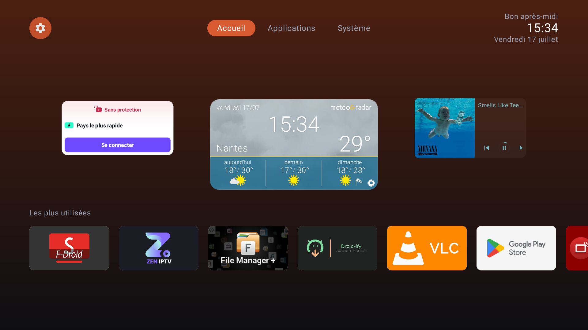

<div align="center">


# My TV Launcher

**A simple, modern home screen for Android TV.**

No ads. No tracking. No account. Works offline.

</div>



## What it does

**A home that's a hub, not a wall of icons.** The first tab keeps a band of widgets above a
short "most used" row — your full app list lives behind the category tabs.

**Apps, organised.** Apps are grouped into categories, and each category is a tab. Long-press
any app to move it to another category (or a brand new one), hide it from the launcher,
uninstall it, or open its system info. Hidden apps come back from Settings.

**Widgets.** Host up to three. Each gets one of five sizes (XS→XL) and sits left, centre or
right. Widgets are hosted at a fixed size and scaled to fit, so making one smaller really
shrinks it rather than cropping it — and the band lays out in thirds so they never overlap.

**Appearance, live.** Accent colour: six presets, or **Auto**, which pulls the colour out of
the focused app's banner and eases between apps. A clock with optional seconds, date and a
time-of-day greeting. Background: ambient banner, accent gradient, or plain. Card size S/M/L.

**Built in Compose for TV** — the old Leanback UI is gone. English and French.

**Updates itself** from GitHub Releases, but only when you ask (Settings → Check for updates).
That is the only time it touches the network.

## Install

Grab the APK from the [latest release](https://github.com/alexcmb/MyTVLauncher/releases/latest)
and sideload it:

```
adb install -r JustTvLauncher-v0.2.apk
```

Android 5.0 (API 21) or newer. Then press Home and pick My TV Launcher.

## Widgets need a one-time permission

Android reserves `BIND_APPWIDGET` for privileged apps and expects a launcher to be
white-listed through a Settings screen that the Android TV build doesn't ship. So on most TV
devices the permission has to be granted once, over adb:

```
adb shell appwidget grantbind --package alexcmb.mytvlauncher
```

Then add the widget again. Devices that do ship the consent screen, or a system widget picker,
are used automatically and need none of this.

## Build

```
./gradlew assembleDebug
```

JDK 17. The debug keystore in `keystore/` is committed on purpose, so local and CI builds
share one signature and the in-app updater can install over an existing install. Pushing a
`vMAJOR.MINOR.PATCH` tag runs the tests, builds the APK and publishes a release.

## License

[GPL-3.0](LICENSE.md)
